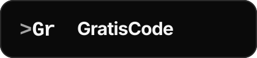

<p align="center">
  
</p>

# GratisCode

GratisCode is a pre-launch landing page for a sponsored AI coding client for Indian builders. The site collects two kinds of public-interest signals only: waitlist registrations and sponsor leads.

It is intentionally small: no model API integration, no payments, no ads, and no analytics/tracking scripts.

## Features

- Waitlist signup form with consent capture
- Sponsor lead form with budget range selection
- Honeypot spam check
- 32KB API body limit and malformed-request rejection before JSON parsing
- Upstash Redis rate limiting by hashed IP and normalized email
- Prisma/PostgreSQL persistence with case-insensitive email uniqueness
- Privacy-safe logging: no raw IP, user agent, form body, prompt, code, repo, or generated output logging
- Production `/admin` hard-disabled until real authentication exists
- Security headers configured in `next.config.ts`

## Tech stack

- Next.js App Router + React
- TypeScript
- Tailwind CSS
- Prisma + PostgreSQL
- Zod validation
- Upstash Redis rate limiting

## Local development

```bash
npm install
cp .env.example .env.local
npm run db:migrate
npm run dev
```

Open <http://localhost:3000>.

Required local environment values are documented in `.env.example`.

## Production deployment

### Required services

- **PostgreSQL** with a pooled connection URL suitable for Vercel/serverless
- **Upstash Redis** REST URL/token for rate limiting
- A strong `IP_HASH_SALT`

Generate a salt:

```bash
node -e "console.log(require('crypto').randomBytes(32).toString('hex'))"
```

### Required environment variables

```env
DATABASE_URL=pooled_postgres_url
UPSTASH_REDIS_REST_URL=...
UPSTASH_REDIS_REST_TOKEN=...
IP_HASH_SALT=long_random_secret
ENABLE_ADMIN=false
```

`DATABASE_URL` must be a pooled endpoint. Do not use a direct Postgres connection URL on Vercel/serverless traffic.

### Deploy steps

```bash
npm run lint
npx prisma generate
npm run build
npx prisma migrate deploy
```

Before deploying migrations to a database with existing data, verify there are no duplicate emails by case-insensitive comparison:

```sql
SELECT lower(email), count(*)
FROM "WaitlistSignup"
GROUP BY lower(email)
HAVING count(*) > 1;

SELECT lower(email), count(*)
FROM "SponsorLead"
GROUP BY lower(email)
HAVING count(*) > 1;
```

Both queries should return zero rows before the functional unique-index migrations run.

## API routes

### `POST /api/waitlist`

Collects waitlist registrations.

### `POST /api/sponsor`

Collects sponsor interest leads.

Both routes:

- require `Content-Type: application/json`
- require `Content-Length`
- reject bodies over 32KB
- reject malformed, primitive, array, and null JSON bodies
- require the honeypot field to exist and be empty
- validate fields with Zod
- rate limit by hashed IP first, then normalized email
- return generic success for duplicate emails to avoid email enumeration

## Security headers

Configured globally in `next.config.ts`:

- Content-Security-Policy
- X-Frame-Options
- X-Content-Type-Options
- Referrer-Policy
- Permissions-Policy
- Strict-Transport-Security

CSP note: production currently allows `script-src 'unsafe-inline'` because Next.js App Router can emit inline bootstrap/flight scripts. This keeps hydration working under `next start`. A stricter nonce/hash CSP should be added only after browser verification.

## Admin

`/admin` is dev-only. In production it returns `404` regardless of environment variables. Do not expose the password-only admin UI publicly.

## QA

Run the production-style checks:

```bash
npm run lint
npx prisma generate
npm run build
npm start
npm run qa:api
```

Then verify in a browser:

- page loads without CSP console errors
- modal opens/closes
- waitlist form submits
- sponsor form submits
- duplicate email returns generic success
- copy email works
- `/admin` returns 404 in production mode
- Network tab shows no analytics/tracker calls

More details are in `QA.md`.

## Brand assets

The terminal-style `>Gr` mark is generated as SVG assets:

```bash
npm run brand:generate
```

Generated files live in `public/brand/`:

- `logo-mark.svg`
- `logo-wordmark.svg`
- `social-card.svg`

## Privacy

See `PRIVACY.md` and the `/privacy` page. The site does not collect private prompts, code, repos, files, generated outputs, or model reasoning.

## License

Private — all rights reserved.
